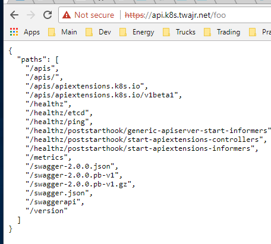

# cka-prep-labs
Labs to help prepare for the Certified Kubernetes Administrator (CKA) Exam

## Current Kubernetes Version
Version: 1.9.1

## Kops on GCE Setup / Notes
The labs described here run with Kubernetes on GCP using the KOPS tool. Herein are notes for creation and setup, etc.

[Getting Started with Kops on GCE](https://github.com/kubernetes/kops/blob/master/docs/tutorial/gce.md)
### Setup
```
PROJECT=`gcloud config get-value project`
export KOPS_FEATURE_FLAGS=AlphaAllowGCE
export KOPS_STATE_STORE=gs://toms-kubernetes-clusters/
```
### Create Cluster (Definition)
```
kops create cluster --name=k8s.twajr.net --zones us-central1-a --project=${PROJECT}
```
Edit the number of nodes, I knock this down to just 1 master and 1 worker node for lab use.
```
kops edit ig --name=k8s.twajr.net nodes
...
  spec:
    image: cos-cloud/cos-stable-60-9592-90-0
    machineType: n1-standard-2
    maxSize: 1
    minSize: 1
```
Notice the image defaults to Google's optomized container image, others also work.
### Spin up the cluster
```
kops update cluster k8s.twajr.net --yes
```
### Adding the Dashboard
Installing the dashboard after cluster creation
```
kubectl create -f https://raw.githubusercontent.com/kubernetes/kops/master/addons/kubernetes-dashboard/v1.8.1.yaml
```
### Getting dashboard credentials
```
$kops get secrets kube --type secret -oplaintext     # bearer token needed on first UI login
$kops get secrets admin --type secret -oplaintext    # admin login password
```
### Adding the EFK Stack
Installing the EFK stack after cluster creation. This requires a PV setup prior to launch. (Need to document)
```
kubectl create -f https://raw.githubusercontent.com/kubernetes/kops/master/addons/logging-elasticsearch/v1.6.0.yaml
```
### Adding the Ingress-Nginx Controller
Installing the ingres-nginx controller is a bit complicated, but it works. Doc:

[Ingress-Nginx Install Guide](https://github.com/kubernetes/ingress-nginx/tree/master/deploy) Just did the generic install, not GCE

Sample app that echos headers:
```
kubectl run echoheaders --image=k8s.gcr.io/echoserver:1.4 --replicas=1 --port=8080
kubectl expose deployment echoheaders --port=80 --target-port=8080 --name=echoheaders-x
kubectl expose deployment echoheaders --port=80 --target-port=8080 --name=echoheaders-y
```
The sample ingress.yaml for above deployments.
```
# An Ingress with 2 hosts and 3 endpoints
apiVersion: extensions/v1beta1
kind: Ingress
metadata:
  name: echomap
spec:
  rules:
  - host: api.k8s.twajr.net
    http:
      paths:
      - path: /foo
        backend:
          serviceName: echoheaders-x
          servicePort: 80
  - host: api.k8s.twajr.net
    http:
      paths:
      - path: /bar
        backend:
          serviceName: echoheaders-y
          servicePort: 80
      - path: /foo
        backend:
          serviceName: echoheaders-x
          servicePort: 80
```
It works:
```
kubectl apply -f ingress.haml
...
kubectl get ingress
NAME      HOSTS                                 ADDRESS         PORTS     AGE
echomap   api.k8s.twajr.net,api.k8s.twajr.net   35.226.210.77   80        43m
```

